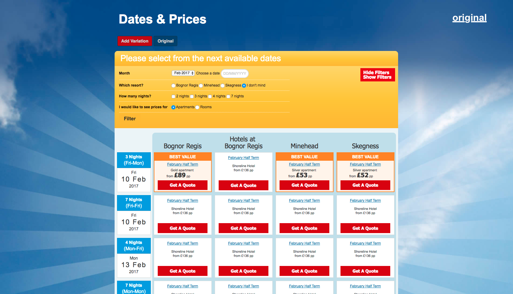
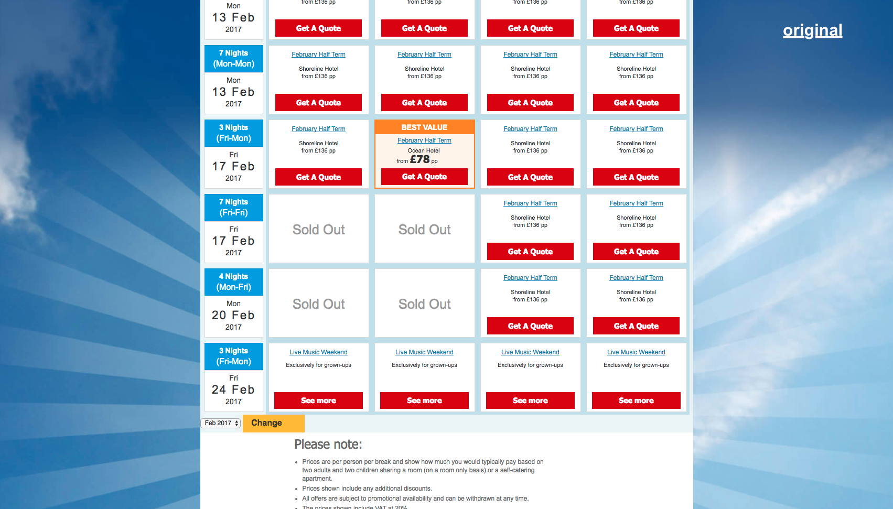
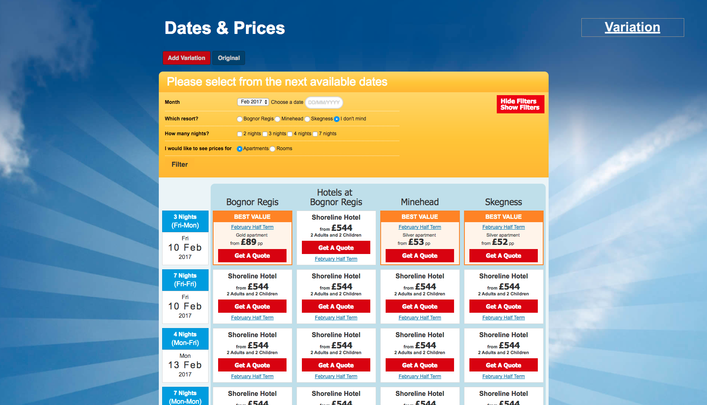
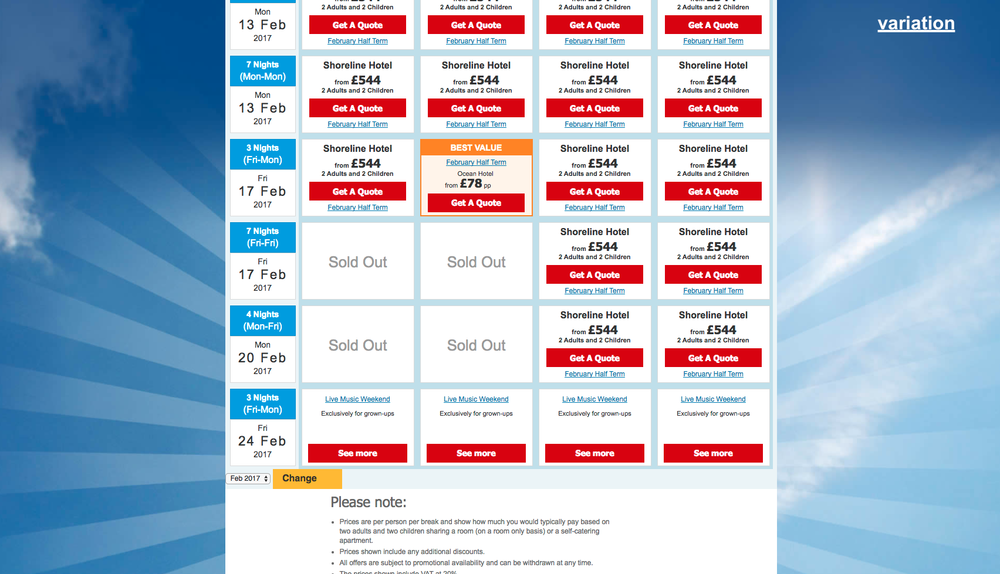

## A/B Testing task &nbsp; :zap:   ``// js/redscript.js``

> Client would like to A/B test on their product offers price grid by
> replacing per person pricing, with unit/family pricing (£ p.p. price x 4) to 
> expose more users to pricing that is more consistent with that in the 
> booking process.

### Applies variations on click event.

 

<kbd>original-top-section</kbd> :cactus:

<kbd>original-bottom-section</kbd> :cactus:

 

<kbd>variation-top-section</kbd> :chestnut:

<kbd>variation-bottom-section</kbd> :chestnut:

